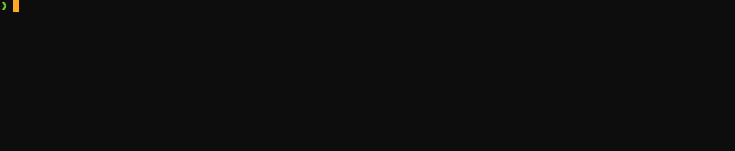

This is a simple tool that given a version and environment, prints the AppCenter download links from the latest version of the apps uploaded in AppCenter



# How To use
Invoke the command `scrapp` (**scr**abble **app**s) with the required parameters

e.g:
> `./scrapp --help`

Will print:

``` bash
Usage: --help [options]
	-v, --version VERSION            Application version to fetch
	-e, --environment ENV            Environment app to fetch
 	--print-json                 Prints json string fetched from app center to console containing all metadata from latest release
```

# Prerequisites:
[App center cli tool](https://github.com/microsoft/appcenter-cli) must be installed and available on your path

# Caveats
This was only tested on MacOS, but should work well in Windows propviding the prerrequisites are met, and that you invoke the ruby script manually instead of using the `scrapp` command as it is a bash script.

On windows, try running
`ruby get-latest-release-appcenter.rb`

e.g:
> `ruby get-latest-release-appcenter.rb --help`
